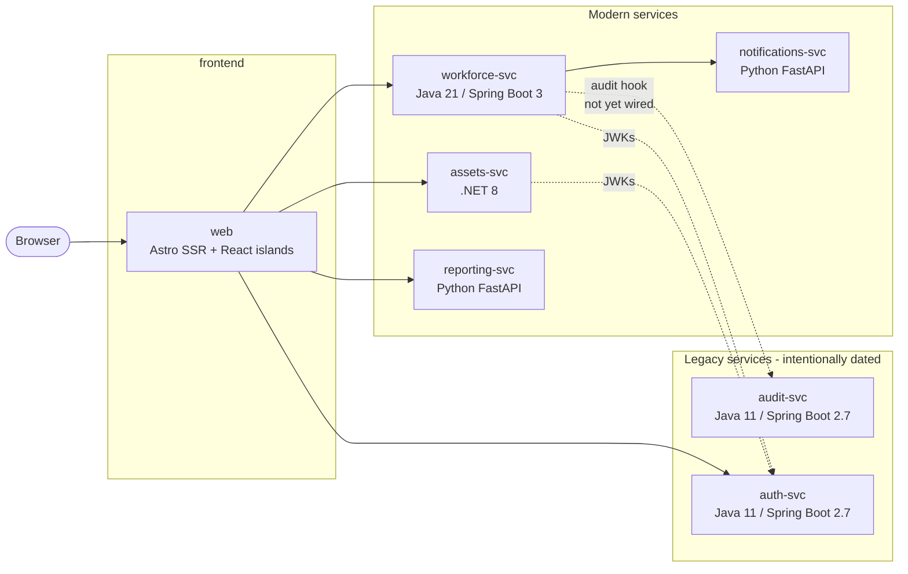

# AssetTrack (Contoso Industries)

AssetTrack is Contoso Industries' internal application for tracking hardware assets (laptops, monitors, phones, badges, docking stations) and the employees they're assigned to. It is intentionally built as a **polyglot microservices** application so that course learners can practice agentic, Copilot-driven development across a realistic multi-language stack — including a couple of older Java services that still need modernization.

## Architecture at a glance



All services talk over **REST/JSON**. Each service owns its own SQLite database.

| Service              | Stack                                  | Port  | Owns                                |
|----------------------|----------------------------------------|-------|-------------------------------------|
| `web`                | Astro (SSR) + React islands + Tailwind | 4321  | UI, BFF composition                 |
| `assets-svc`         | .NET 8 (ASP.NET Core minimal APIs)     | 5001  | Asset CRUD + search                 |
| `workforce-svc`      | Java 21 / Spring Boot 3                | 5002  | Employees + Assignments             |
| `reporting-svc`      | Python 3.12 / FastAPI                  | 5003  | Reports, CSV bulk import            |
| `notifications-svc`  | Python 3.12 / FastAPI                  | 5004  | Webhook receiver, email/Slack stub  |
| `audit-svc`          | Java 11 / Spring Boot 2.7 *(legacy)*   | 5005  | Audit event log                     |
| `auth-svc`           | Java 11 / Spring Boot 2.7 *(legacy)*   | 5006  | JWT issuer, user lookup             |

## Quick start (Codespaces)

1. Open the repository in GitHub Codespaces.
2. Wait for the devcontainer to finish provisioning (Docker-in-Docker, .NET 8, Java 21, Python 3.12, Node 20 are all preinstalled).
3. From the workspace root:

   ```bash
   docker compose up --build
   ```

4. Open the forwarded port for `web` (4321) — that's the UI. The other ports are the backend services if you want to poke them directly with `curl`.

## Quick start (local)

You need Docker. Then:

```bash
docker compose up --build
```

Open http://localhost:4321.

## Running a single service for development

Each service folder has its own `README.md` with native (non-Docker) run instructions and per-service scripts. See:

- [`services/web/README.md`](services/web/README.md)
- [`services/assets-svc/README.md`](services/assets-svc/README.md)
- [`services/workforce-svc/README.md`](services/workforce-svc/README.md)
- [`services/reporting-svc/README.md`](services/reporting-svc/README.md)
- [`services/notifications-svc/README.md`](services/notifications-svc/README.md)
- [`services/audit-svc/README.md`](services/audit-svc/README.md)
- [`services/auth-svc/README.md`](services/auth-svc/README.md)

## Auth

`auth-svc` issues RS256 JWTs from `POST /token`. Other services validate tokens via the JWKs document at `http://auth-svc:8080/.well-known/jwks`.

For course exercises that aren't about auth, the frontend runs with `DEV_TOKEN_MODE=true`, which uses a pre-issued long-lived token so learners aren't blocked by login flows. To exercise the real flow, set it to `false`.

## What's intentionally broken or missing

This is a teaching codebase. Several services have deliberate gaps that drive the course exercises (see [`exercises.md`](exercises.md)). For example:

- The two legacy Java services use raw JDBC string concatenation and have SQL injection.
- `reporting-svc` has old-style Python helpers and an import endpoint that crashes on bad rows.
- `assets-svc` accepts unvalidated input on create.
- The dashboard renders some status badges with the wrong colors.
- `workforce-svc` does not yet POST to `audit-svc` on assignment changes.

See [`exercises.md`](exercises.md) for the full exercise list.

## Course exercises

See [`exercises.md`](exercises.md). Each exercise is **atomic** — completing one is not a prerequisite for another. Exercises cover all five stacks (Astro, .NET, modern Java, Python, legacy Java) so learners can pick what's most useful to them.
